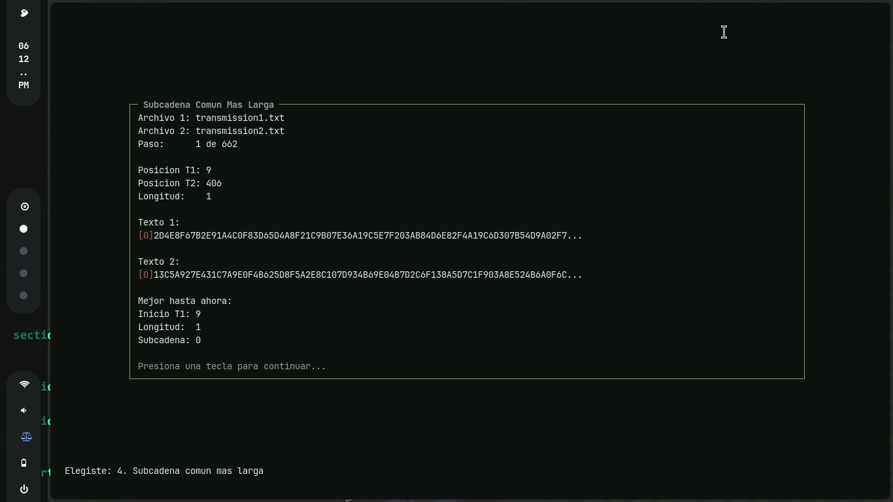
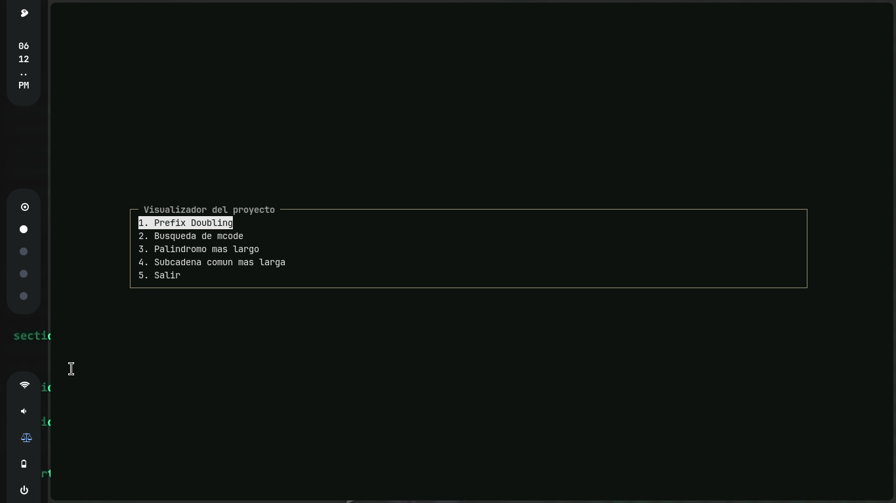

# MenuNcurses-

Juro que lo documentaré

...

algún día

## Inclusión de librerías + compilación

g++ -std=c++17 main.cpp MenuNcurses.cpp DetalleNcurses.cpp InputNcurses.cpp -lncurses -o programa

